---

---

# 一、准备工作

## 1 开发工具

* Vscode: 常用开发工具

  * 下载地址： [官网](https://code.visualstudio.com)
    使用默认配置安装，过程不赘述。

  * 插件安装

    在应用商店中安装必要的开发插件，应用商店可以通过侧边栏或快捷键Ctrl+Shift+x打开：

    * C语言开发插件：C/C++

  	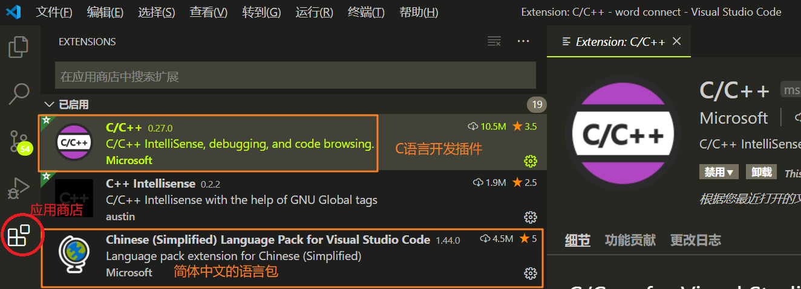

  * 简体中文语言包：Chinese (Simplified) Language Pack for Visual Studio Code

    Ctrl+Shift+p打开命令行，输入“Configure Display Language”,确定后选择zh-cn:

    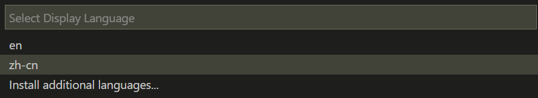
    
    重启vscode后,界面就从英文切换到中文。

## 2 编译工具

### 2.1 免配置
  当前已经配置好基础工程，如果您不想折腾，请直接使用Vscode打开工程目录即可使用：

  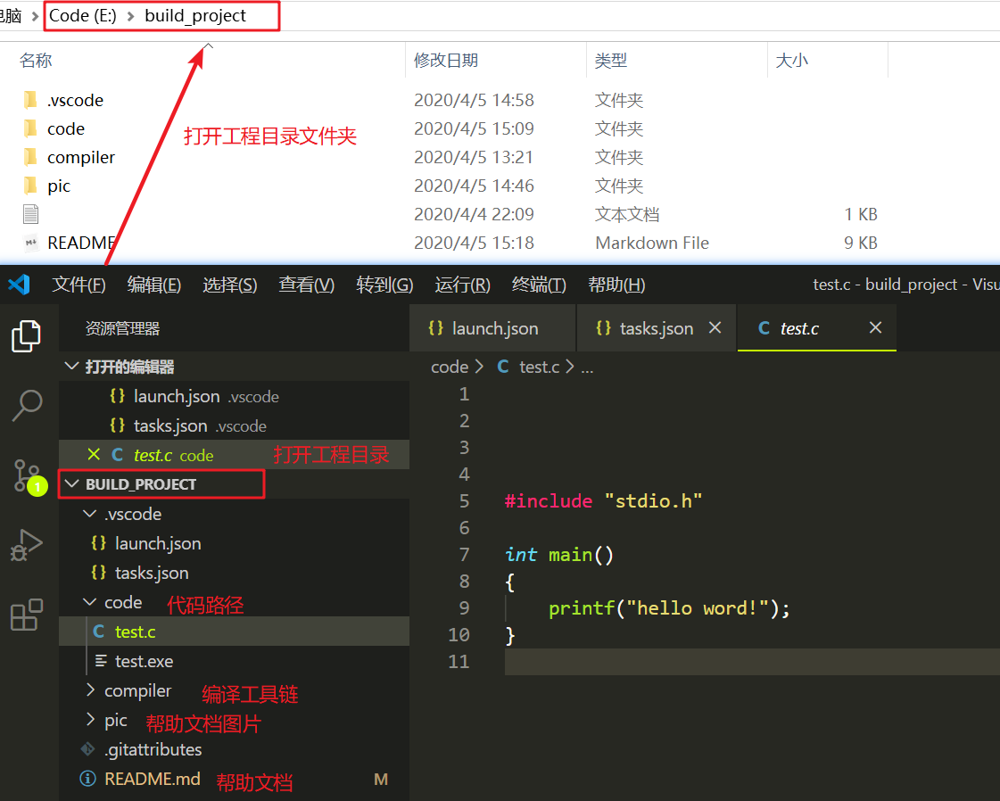

--------

​                                                                                   END

--------

想要了解更多，请继续往下看：

​	主流的编译工具链为MinGW（*32bit: MinGW 64bit:MinGw-w64*），TDM-GCC等，他们之间的区别如下：

[区别：https://www.zhihu.com/question/39952667]( https://www.zhihu.com/question/39952667)

本文介绍MinGW和TDM-GCC的安装、配置方法，用户**只需要选择其中任意一个工具**安装即可。

### 2.2 MinGW
	以64位 windows系统为例，需要安装MinGw-w64。

* 下载地址
  * [官网](http://www.mingw.org/):下载一个minGW的下载器，然后再通过下载器下载minGW.

    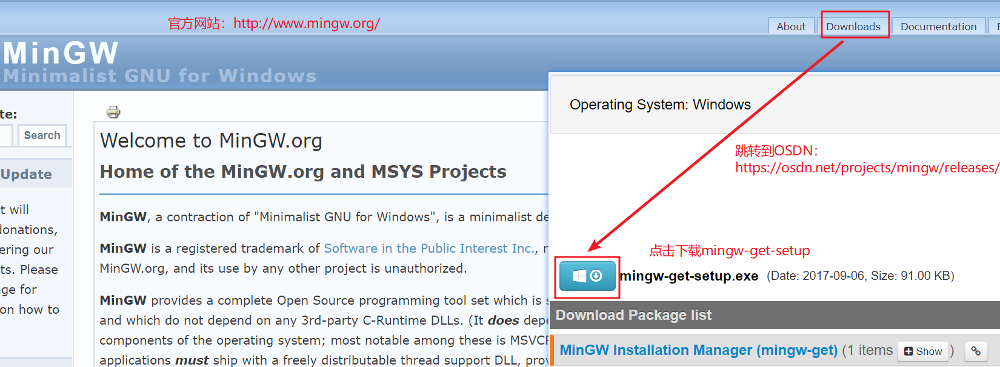

  * [GitHub 本工程](https://github.com/chenliangping/build_project/blob/master/compiler/minGW/mingw-get-setup.exe):最新版已集成到工程中(集成日期：2020/4/5)。
  
    
  
*	安装
    按照默认配置安装，安装完成后会再桌面生成一个图标，同时自动打开下载器界面：
    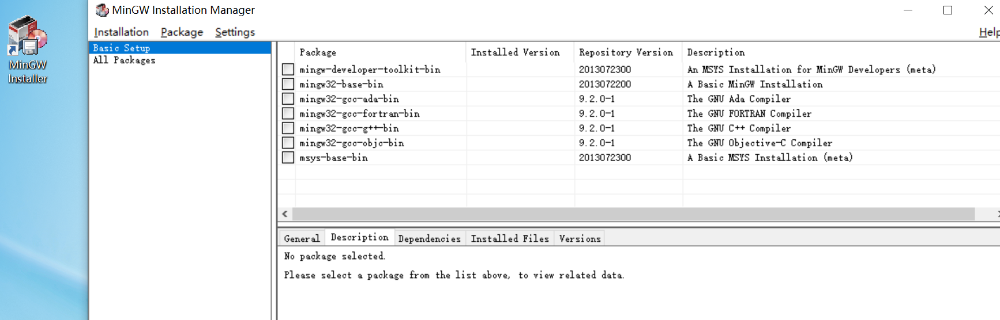
    
    在All Packages->MinGW Base System->Basic Setup选择所有组件，右键标记为安装，然后在菜单栏Installation->Apply Changes。
    
    *说明：对C/C++，只需要选择mingw-gcc-bin, mingw-gcc-dev, mingw-gcc-lic这四个组件就可以了。为了简单，也可以全部选择安装*
    
    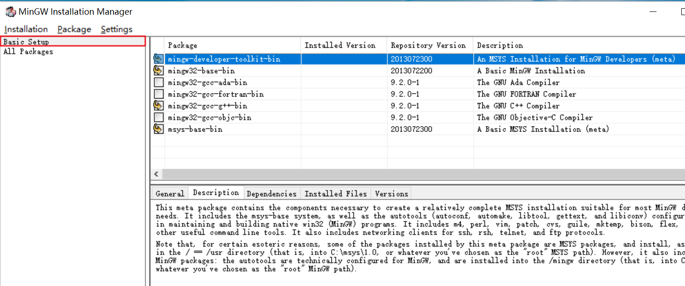
    
    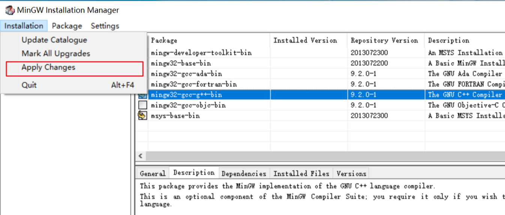
    
    由于直接从国外服务器下载，网速较慢，下载耗时较长，需要耐心等待。
    
    安装完成后，在安装目录（默认：C:\MinGW\bin\）下会生成三个文件：g++.exe、gcc.exe、gdb.exe三个文件。

   

*	环境变量配置
   
   鼠标右键“我的电脑”->“属性”，选择“高级”选项卡下的“环境变量”，在系统变量里点“新建”，之后填写MinGW的安装路径，如下：
   
   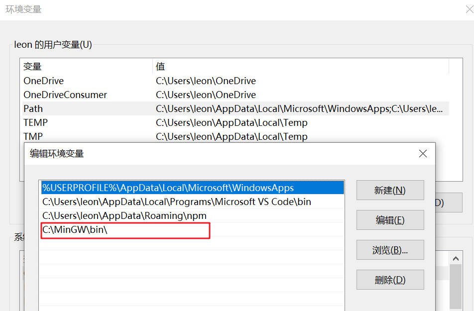

### 2.3 TDM-GCC

​	*说明：如果你已经安装了minGW,就无需再安装TDM-GCC。*

* 下载地址

  * [官网]( http://tdm-gcc.tdragon.net/download)：打开非常慢，甚至打不开，不推荐

  * [GitHub 官方](https://jmeubank.github.io/tdm-gcc/download/)：下载最新版本

  * [GitHub 本工程](https://github.com/chenliangping/build_project/blob/master/compiler/tdm-gcc/tdm64-gcc-9.2.0.exe)：已经当前最新版继承到工程中(集成日期：2020/4/5)。

    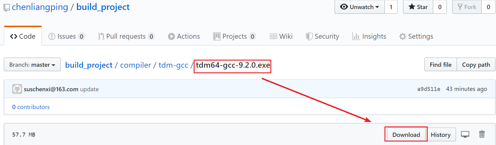

安装后，需要添加TDM-GCC到环境变量中:
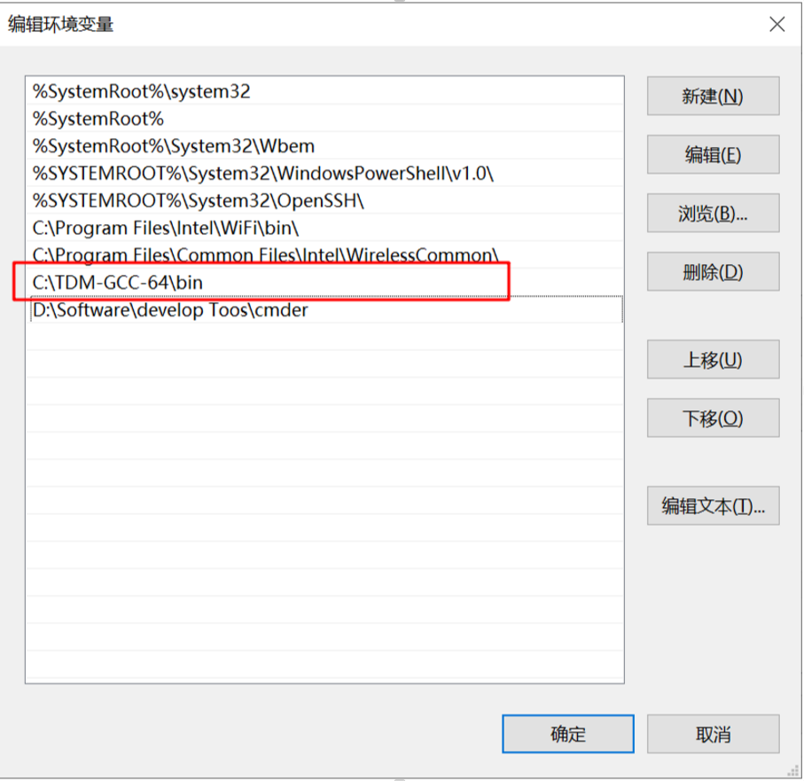

# 二、配置新工程
​      新建一个空文件夹作为工程目录，使用vscode打开该文件夹，然后新建一个.c文件：

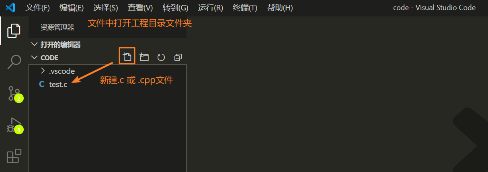

任意写一个函数，按F5调试，弹出界面选择GDB：

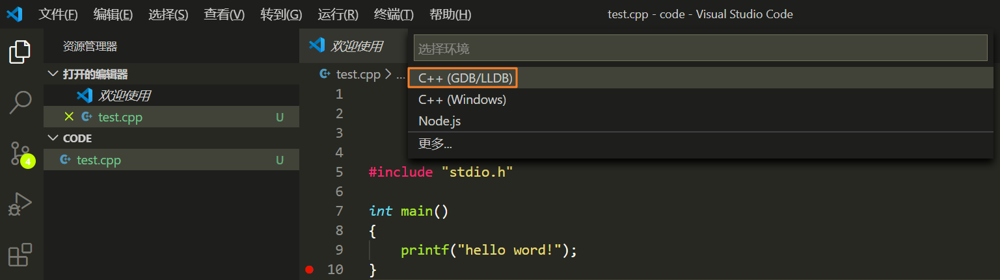

然后选择“gcc.exe-生成和调试活动文件”：

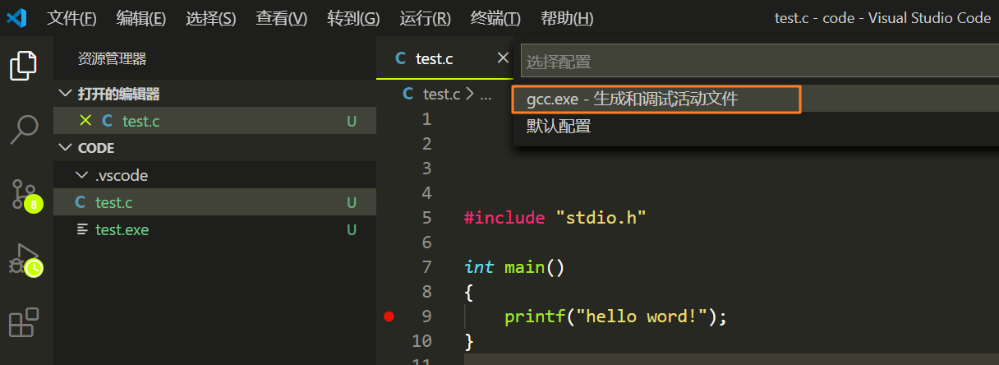

自动生成两个文件：”lauch.json" 和 “tasks.json“，此时函数已经可以处于调试状态。

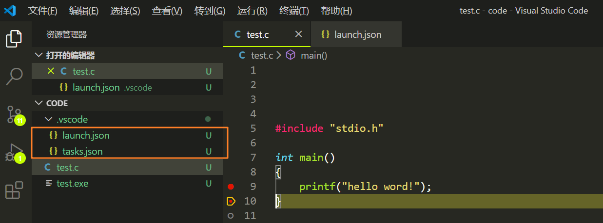      

​	到这里，已经可以开始调试程序了。有兴趣的继续往下看：

### lauch.json

~~~
{
    // 使用 IntelliSense 了解相关属性。 
    // 悬停以查看现有属性的描述。
    // 欲了解更多信息，请访问: https://go.microsoft.com/fwlink/?linkid=830387
    "version": "0.2.0",
    "configurations": [
        {
            "name": "gcc.exe - 生成和调试活动文件",
            "type": "cppdbg",
            "request": "launch",
            "program": "${fileDirname}\\${fileBasenameNoExtension}.exe",
            "args": [],
            "stopAtEntry": false,
            "cwd": "${workspaceFolder}",
            "environment": [],
            "externalConsole": false, 
            "MIMode": "gdb",
            "miDebuggerPath": "D:\\Software\\win\\mingw64\\bin\\gdb.exe",
            "setupCommands": [
                {
                    "description": "为 gdb 启用整齐打印",
                    "text": "-enable-pretty-printing",
                    "ignoreFailures": true
                }
            ],
            "preLaunchTask": "gcc.exe build active file"
        }
    ]
}
~~~

**重点关注的配置参数**：

*1）"externalConsole"* 

​	fasle:	默认值，调试输出到调试区"终端"中；

​	true:	输出调试信息到独立控制台窗口，类似vs。 

​	本参数视个人喜好配置。

*2）"miDebuggerPath"*

​	编译器工具链中包含gdb可执行文件，这里对应gdb的路径。

*3）"preLaunchTask"*

​	程序启动时，要运行的任务名称，任务信息是在tasks.json中。启动时，通过lauch.json中的任务名称在tasks.json中找到要执行的任务“gcc.exe build active file”。lauch.json中任务名称是在preLaunchTask参数；而tasks.json中的任务名称是在label参数，两者名称完全相同，这样任务才能关联起来。

### tasks.json
~~~
{
    "tasks": [
        {
            "type": "shell",
            "label": "gcc.exe build active file",
            "command": "D:\\Software\\win\\mingw64\\bin\\gcc.exe",
            "args": [
                "-g",
                "${file}",
                "-o",
                "${fileDirname}\\${fileBasenameNoExtension}.exe",
                //【增加】新增下面2行，解决中文乱码,上一行末尾许需要加逗号。
                "-fexec-charset=gbk",
                "-finput-charset=UTF-8" 
            ],
            "options": {
                "cwd": "D:\\Software\\win\\mingw64\\bin"
            }
        }
    ],
    "version": "2.0.0"
}
~~~

**重点关注的配置参数**：

*1）"label"*

​	任务名称，需要和lauch.json中preLaunchTask参数配置一致。

*2）"command"*,

​	gcc.exe可执行文件的路径。

*3)"args"*
~~~
	gcc默认编译选项：
		-g 可执行程序包含调试信息
		-o 指定输出文件名
		${file}:文件自身的绝对路径
		${fileBasename}:当前文件的文件名
		${fileBasenameNoExtension}:当前文件的文件名，不带后缀
~~~
为解决中文乱码问题，在编译选项最后一行加**逗号**，换行后新增加2行：
~~~
	"${fileDirname}\\${fileBasenameNoExtension}.exe", 				// 末尾加逗号","
	"-fexec-charset=gbk", 											//新增第一行
    "-finput-charset=UTF-8" 										//新增第二行
~~~

### c_cpp_properties.json

如果出现头文件不识别，如下：

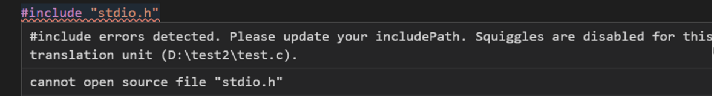

点击小灯泡后，会自动生成c_cpp_properties.json：

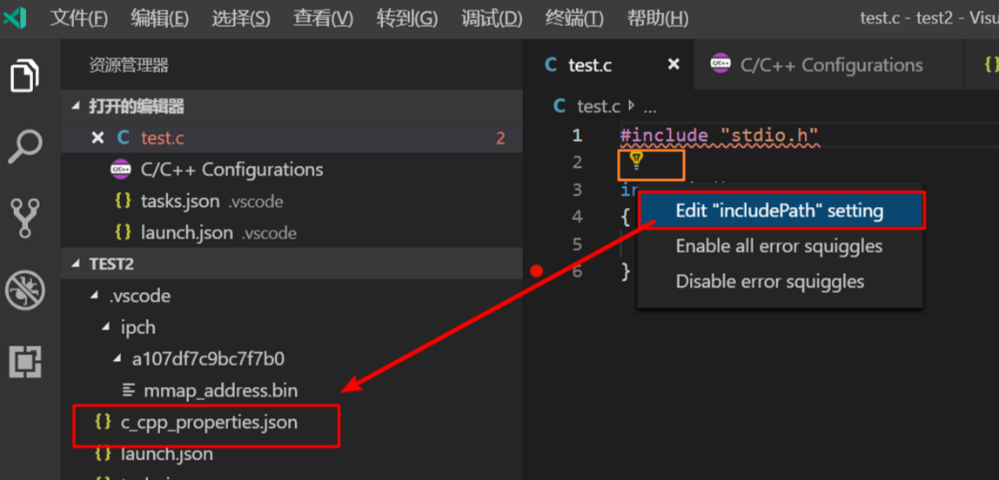

添加头文件包含目录：

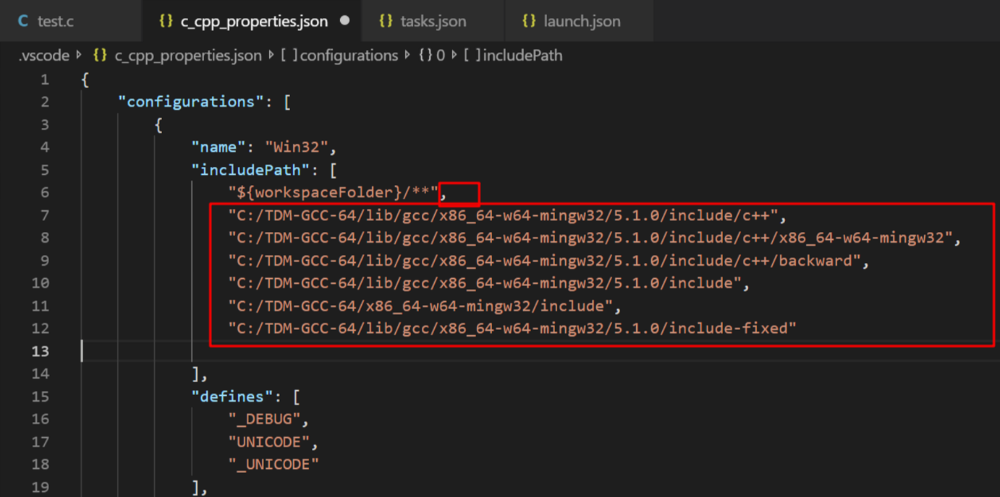

# 三、参考
* *1） https://www.cnblogs.com/ghjnwk/p/10415294.html*
* *2）https://www.cnblogs.com/ghjnwk/p/9806677.html*

